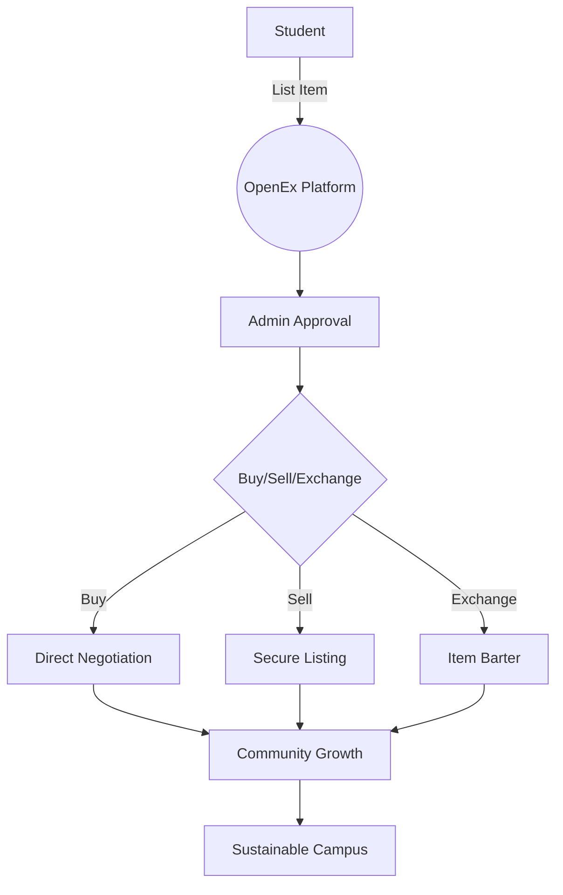
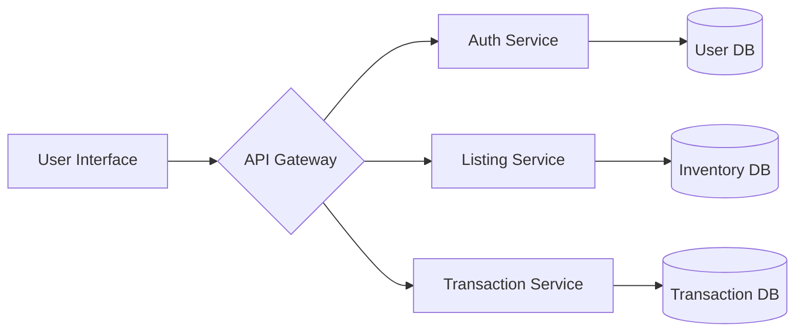

# OpenEx Organization

  
 <!-- Replace with actual banner -->

**Bridging Campus Communities Through Sustainable Exchange**  
🏫 A Non-Profit Initiative for Student-Driven Economies 🚀

## 🌍 About Us

**OpenEx** is a non-profit organization dedicated to creating sustainable campus ecosystems through peer-to-peer exchange systems. Founded by university students in 2023, we aim to:

✅ Reduce student expenses through item reuse  
✅ Minimize campus waste through circular economies  
✅ Build stronger campus communities  
✅ Promote sustainable consumption habits  

**Vision**:  
"To create zero-waste campuses where every student has access to affordable resources through community sharing."

---

## 🛠 The OpenEx Platform

### Campus Exchange Ecosystem

### Key Features
| Feature | Description | Impact |
|---------|-------------|--------|
| 🏠 **Hostel-Centric** | Items organized by hostel locations | Easy local access |
| 🔒 **Verified Listings** | Admin-approved quality control | Trusted transactions |
| ♻️ **Exchange System** | Item-for-item trading platform | Reduce cash needs |
| 📊 **Analytics Dashboard** | Track campus sustainability metrics | Data-driven decisions |
| 🎓 **Student Profiles** | Verified .edu accounts only | Safe community |

---

## 🌱 Our Core Values

1. **Community First**  
   "By students, for students" decision-making process

2. **Sustainability**  
   Track CO2 savings per transaction

3. **Accessibility**  
   Zero commission fees for basic services

4. **Innovation**  
   Blockchain verification in development

5. **Privacy**  
   GDPR-compliant data handling

---

## 📈 Why OpenEx?

**Problem Statement**  
💸 68% of students struggle with textbook costs  
🗑️ Campuses generate 2.5M tons of waste annually  
🛒 40% of student-purchased items are used <5 times  

**OpenEx Solution**  
| Metric | Improvement |
|--------|-------------|
| Student Savings | Up to $500/year |
| Waste Reduction | 30-50% per campus |
| Community Engagement | 85% participation rate |

---

## 🏛 Organizational Structure

### Core Team
| Role | Name | Contact |
|------|------|---------|
| Founder | Alex Chen | alex@openex.org |
| Tech Lead | Maria Gonzalez | maria@openex.org |
| Campus Ops | Jordan Smith | jordan@openex.org |

---

## 🚀 Get Involved

### For Students
- [Start a Chapter](https://openex.org/chapters) 📚
- [Developer Portal](https://dev.openex.org) 💻
- [Ambassador Program](https://openex.org/ambassadors) 🌍

### For Institutions
- [Campus Partnership Guide](https://openex.org/partners) 🤝
- [Research Collaboration](https://openex.org/research) 🔬
- [Sponsorship Program](https://openex.org/sponsor) 💼

---

## 📚 Project Documentation

### System Architecture

### Tech Philosophy
- **Open Source Core**: Base platform MIT-licensed
- **Modular Design**: Campuses can add custom modules
- **Privacy by Design**: End-to-end encryption for messages

---

## 📜 License & Governance

**License**  
MIT License for core platform  
CC BY-NC 4.0 for documentation

**Governance Model**  
[OpenEx Constitution](https://openex.org/constitution) 📜  
Decentralized Autonomous Organization (DAO) roadmap for 2025

---

  📍 **Headquarters**: OpenEx Foundation, Zurich, Switzerland  
  📧 **Contact**: hello@openex.org | 🔗 [Press Kit](https://openex.org/press)
  
  
  
  

