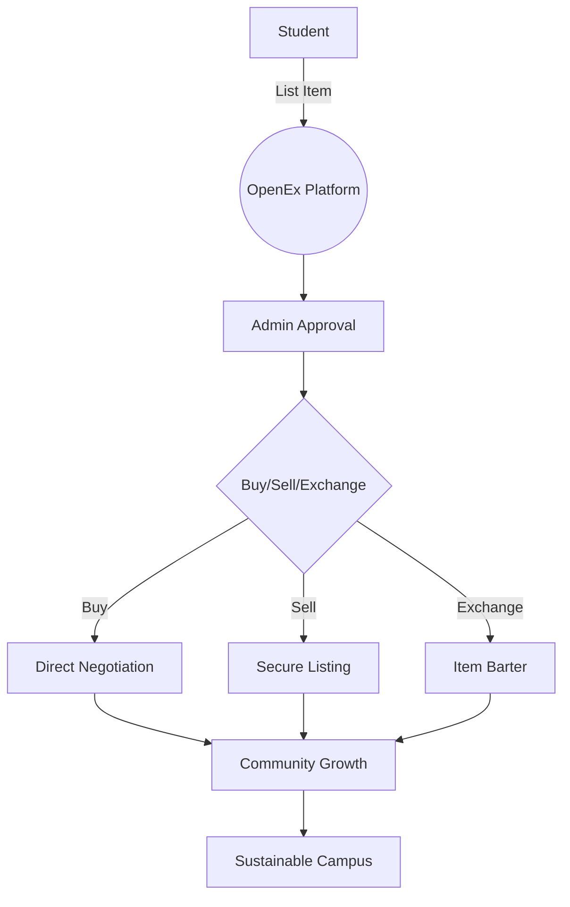

# OpenEx Organization

**Bridging Campus Communities Through Sustainable Exchange**  
🏫 A Non-Profit Initiative for Student-Driven Economies 🚀

## 🌍 About Us

**OpenEx** is a non-profit organization dedicated to creating sustainable campus ecosystems through peer-to-peer exchange systems. Founded by university students, we aim to:

✅ Reduce student expenses through item reuse  
✅ Minimize campus waste through circular economies  
✅ Build stronger campus communities  
✅ Promote sustainable consumption habits  

**Vision**:  
"To create zero-waste campuses where every student has access to affordable resources through community sharing."

---

## 🛠 The OpenEx Platform

### Campus Exchange Ecosystem

### Key Features
| Feature | Description | Impact |
|---------|-------------|--------|
| 🏠 **Hostel-Centric** | Items organized by hostel locations | Easy local access |
| 🔒 **Verified Listings** | Admin-approved quality control | Trusted transactions |
| ♻️ **Exchange System** | Item-for-item trading platform | Reduce cash needs |
| 📊 **Analytics Dashboard** | Track campus sustainability metrics | Data-driven decisions |
| 🎓 **Student Profiles** | Verified .edu accounts only | Safe community |

---

## 🌱 Our Core Values

1. **Community First**  
   "By students, for students" decision-making process

2. **Sustainability**  
   Track CO2 savings per transaction

3. **Accessibility**  
   Zero commission fees for basic services

4. **Innovation**  
   Blockchain verification in development

5. **Privacy**  
   GDPR-compliant data handling

## 🏛 Organizational Structure

### Core Team
| Role | Name | Contact |
|------|------|---------|
| Founder | Anonymous | ? |
| Tech Lead | Anonymous | ? |
| Campus Ops | Anonymous | ? |

---
